# Aberration Algorithm

This algorithm is designed for detecting when seismic activity begins on the Moon and Mars. [This](https://www.spaceappschallenge.org/nasa-space-apps-2024/find-a-team/aberration1/?tab=project) is our NASA Space Apps 2024 submission.


## Installation
Should you want to run our models on your device, download and install the packages in the `requirements.txt` file by running
```
    pip install requirements.txt
```
in your command prompt.

Clone the repository and feel free play around with the notebooks.

We are using
- Python version 3.12.6,
- Tensorflow version 2.17.

We also attempted to do GPU training. In that case, we used
- Python version 3.10.11,
- Tensorflow version 2.10,
- CUDA Toolkit version 11.2,
- CUDNN version 8.1.


## Data
### Format
The data was provided by the [Space Apps 2024 Seismic Detection Data Packet](https://wufs.wustl.edu/SpaceApps/data/space_apps_2024_seismic_detection.zip).

The training and testing data, for both the Moon and Mars, where given in `.csv` and `.mseed` files, so we made sure that our model works well at taking both as input. Additionally, our model *should* be able to accept `numpy` data.


### Files
The files are too large to push through Git to GitHub directly, so we make the following warning:
> **WARNING:** Due to unstable internet connections, some data might take an especially extra time to add to the repository. Should the original raw training and testing data not be in the folder `./data`, make sure to download the data from the link above and move/copy/cut the folders `lunar` and `mars` from the downloaded .zip file to inside the root folder `./data` in this repository.


### Pre-processing Data
We taught some models with the raw data and some others with cleaned data. The cleaned data involves taking the raw data, applying a detrending function, applying a taper, and subtracting off a band of frequencies that consistently appeared to have noise. The code for that can be seen [here](./data/processed/process_data.ipynb). The output of this file generates the data found in the `./data/processed/` folder.


## Models
### Classical Models
- [Short-Term Average / Long-Term Average (STA/LTA)](./models/classical/sta_lta.ipynb)
    - **Code:** `./models/classical/sta_lta.ipynb`.
    - **Input:** Processed data.
    - **Output:** `./predictions/sta_lta/`.
### Machine Learning Models
- [Convolutional Neural Network Using TensorFlow](./models/machine_learning/cnn_sigmoid.ipynb) **(MAIN)**
    - **Code:** `./models/machine_learning/cnn.ipynb`.
    - **Model:** All `.keras` or `.hd5` files in `./trained_models/` with `cnn` at the beginning.
    - **Input:** Raw and processed data.
    - **Output:** `./predictions/cnn/`.

- [Random Forest Classifier Using ScikitLearn](./models/machine_learning/sklearn.ipynb)
    - **Code:** `./models/machine_learning/sklearn.ipynb`.

- [Regular Neural Network Using PyTorch](./models/machine_learning/pytorch.ipynb)
    - **Code:** `./models/machine_learning/pytorch.ipynb`.

- [Forecasting Anomaly Detection Using Darts](./models/machine_learning/darts.ipynb)
    - **Code:** `./models/machine_learning/darts.ipynb`.

### Aberration Algorithm Online
If you head over to https://aberration.dev/ and select `Detect Quake` from the navbar above, you can upload any `.csv` file of a seismic data, as long as you have your column heads set properly, or given to us (using the input fields), we will apply our model and attempt to find the arrival time in your seismic data.
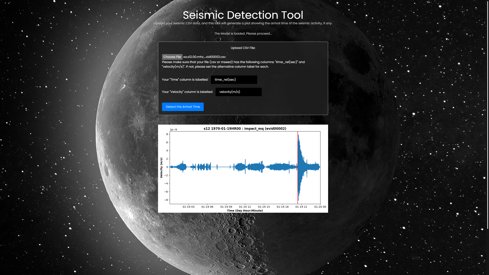

It may take some time to process as this is all done on an online server. If you get the same data set and prediction in the image above, then the server must have timed out (since it costs to run it indefinitely) and instead outputs a template image (the one seen above). 

## Predictions
### Output Files
All the output files are in the `./predictions` folder. They subfolders contain the individual data of each file specifically. From those, we run the `generate_catalogs.ipynb` notebook to generate the final .csv output file that contains the location of the predicted arrival time in each file, with its corresponding `filename`, `time_abs` amd `time_rel` columns.
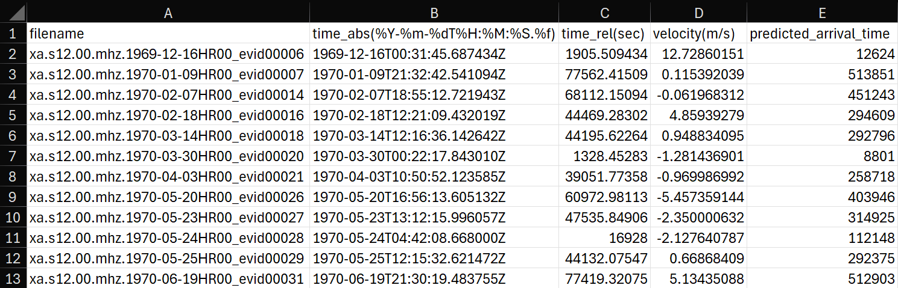

### Model Used
The model we used to generate our final predictions for this challenge is `./trained_models/lunar/cnn_sigmoid_moon_processed__events3_windowsize64_batchsize500_smoothing0.05_epochs10.keras`.  Additionally, for Mars data, we took that model and trained it on the Mars training sets, and the model is `./trained_models/trained_on_both.keras`.

This is how our model performed during training:
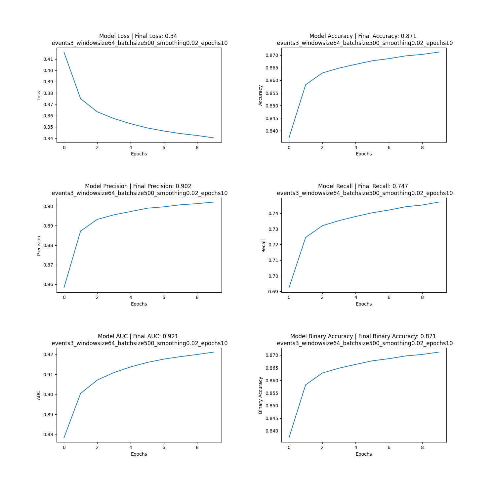

To calculate how well our model predicts the arrival time of the seismic wave, we use the following equation that determines the error, and hence, the accuracy:
- Distance Error:
$$E_{\text{distance}} = \frac{\text{True Arrival Time} - \text{Predicted Arrival Time}}{\text{Length of Event}}.$$
- Accuracy:
$$\text{Accuracy} = 1 - E_{\text{distance}}.$$

### Moon
#### Training
When applied to one of the lunar training data sets, this is what our model outputs
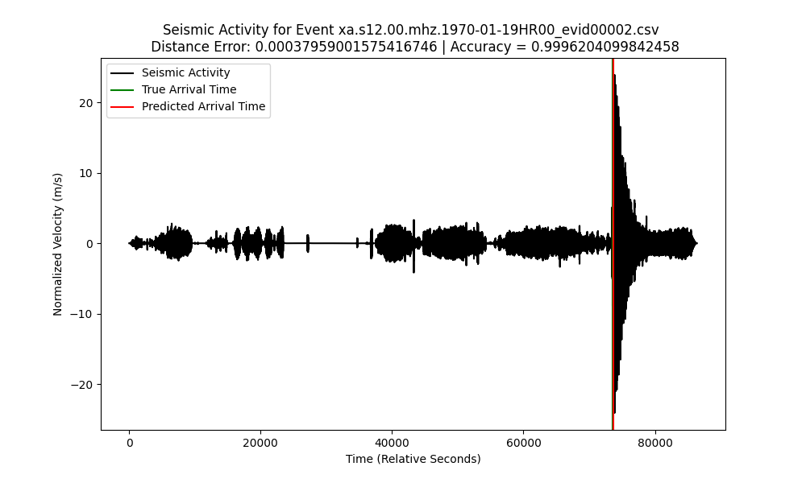
- **Output CSV:** `./predictions/cnn/lunar/train/xa.s12.00.mhz.1970-01-19HR00_evid00002.csv__results_processed__events76_windowsize64_batchsize500_smoothing0.02_epochs10.csv`.
- **True Anomaly Time:** At 73500 seconds.
- **Predicted Anomaly Time:** At 73717 seconds.
- **Distance Error:** 0.0003795 or 0.03795%.
- **Accuracy:** 0.99962 or 99.962%.

Here are some other predictions
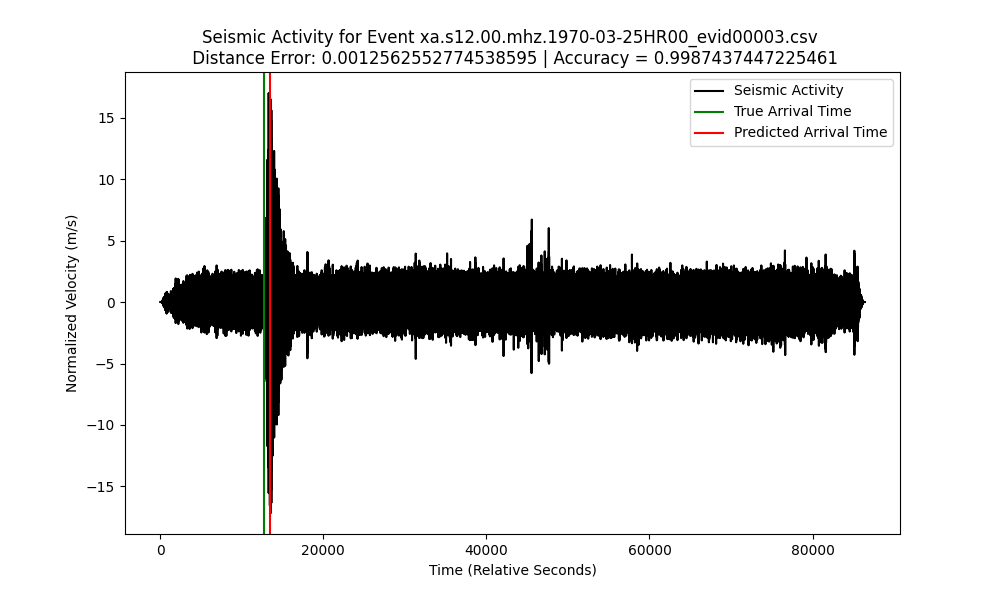
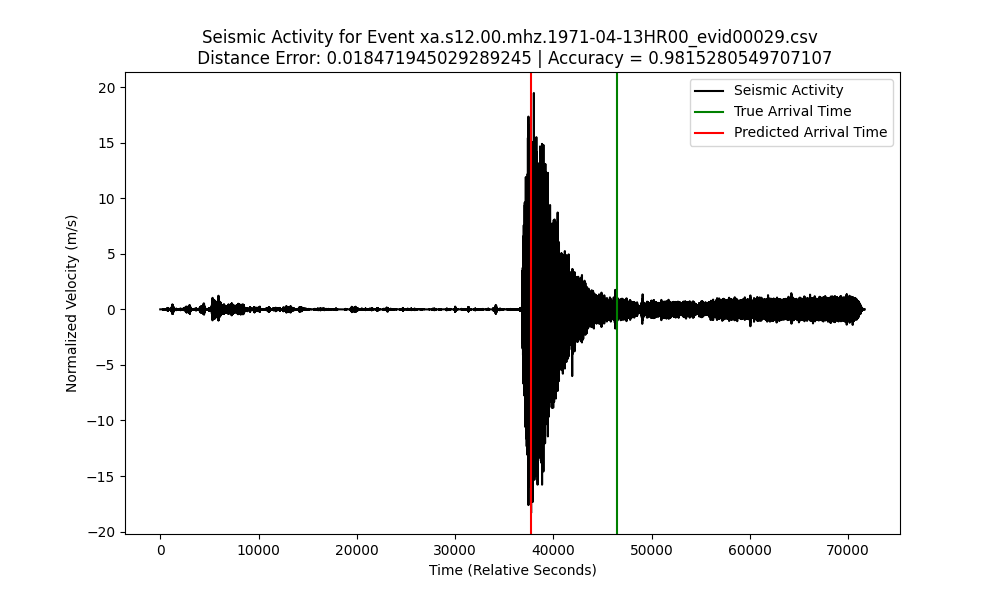

Notice that in the last image, the true arrival time label is wrong. We predict it correctly.

#### Testing
When applied to one of the lunar testing data sets, this is what our model outputs
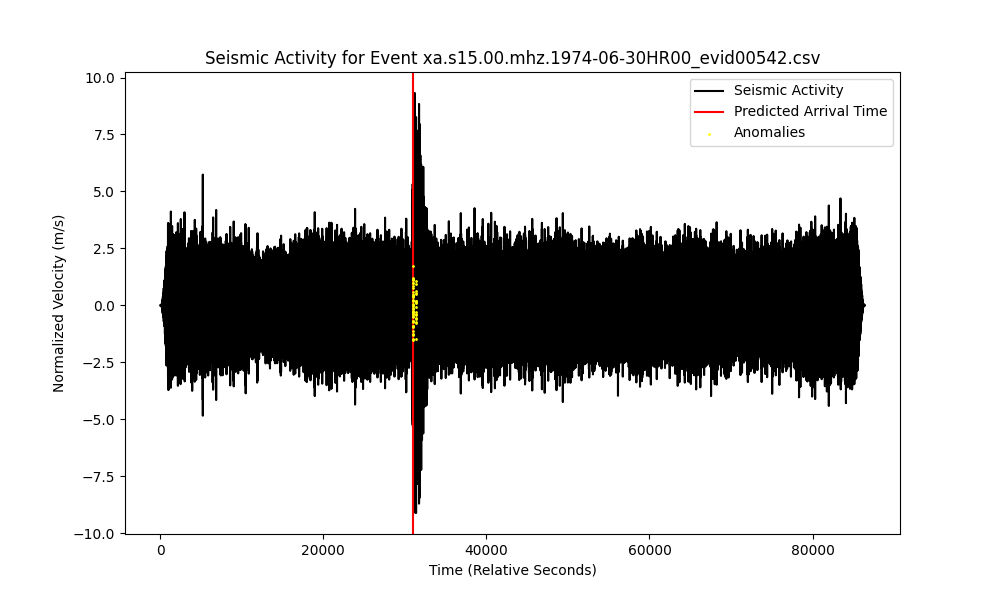
- **Output CSV:** `./predictions/cnn/lunar/test/S15_GradeB/xa.s15.00.mhz.1974-06-30HR00_evid00542.csv__results_processed__events3_windowsize64_batchsize500_smoothing0.02_epochs10.csv`.
- **Predicted Anomaly Time:** At 31028 seconds.

Here are some other predictions
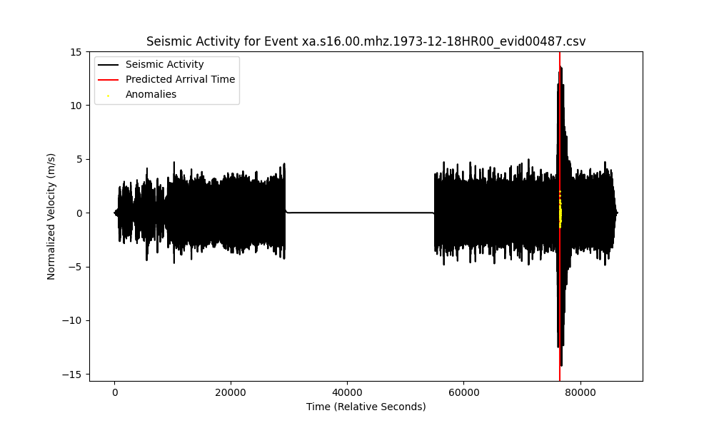
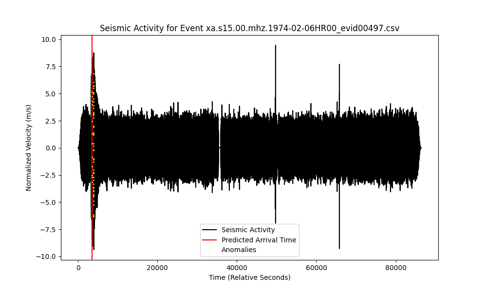


### Mars
#### Training
When applied to one of the lunar training data sets, this is what our model outputs
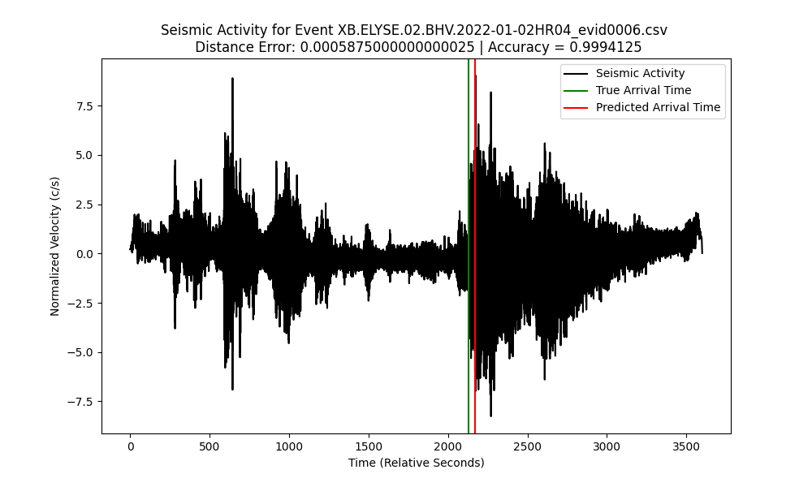
- **Output CSV:** `./predictions/cnn/mars/train/`.
- **True Anomaly Time:** At 2130 seconds.
- **Predicted Anomaly Time:** At 2172 seconds.
- **Distance Error:** 0.000587 or 0.0587%.
- **Accuracy:** 0.9941. or 99.94%.

The only other training data set is the following
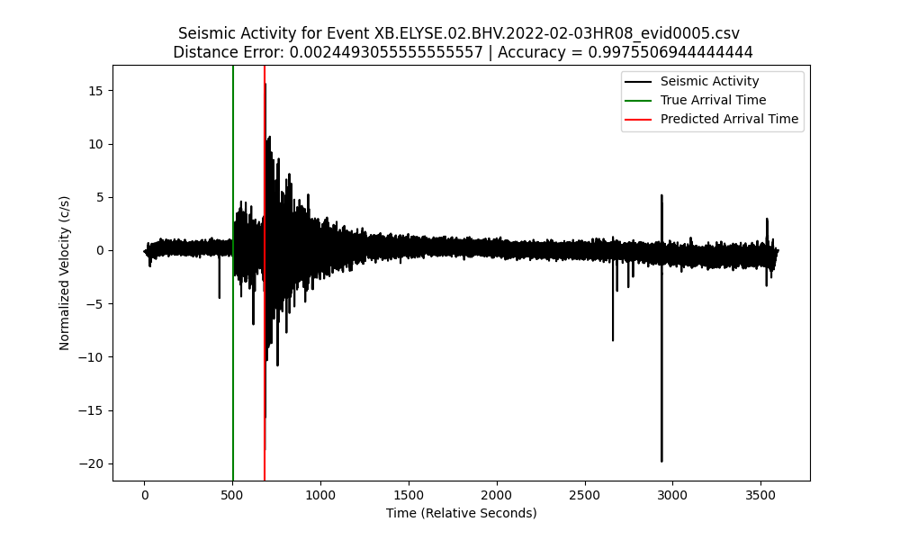

#### Testing
When applied to one of the lunar testing data sets, this is what our model outputs
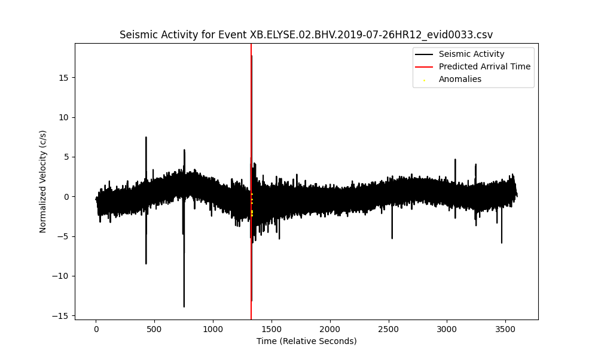
- **Output CSV:** `./predictions/cnn/mars/test/`.
- **Predicted Anomaly Time:** At 1,329 seconds.

Here are some other predictions
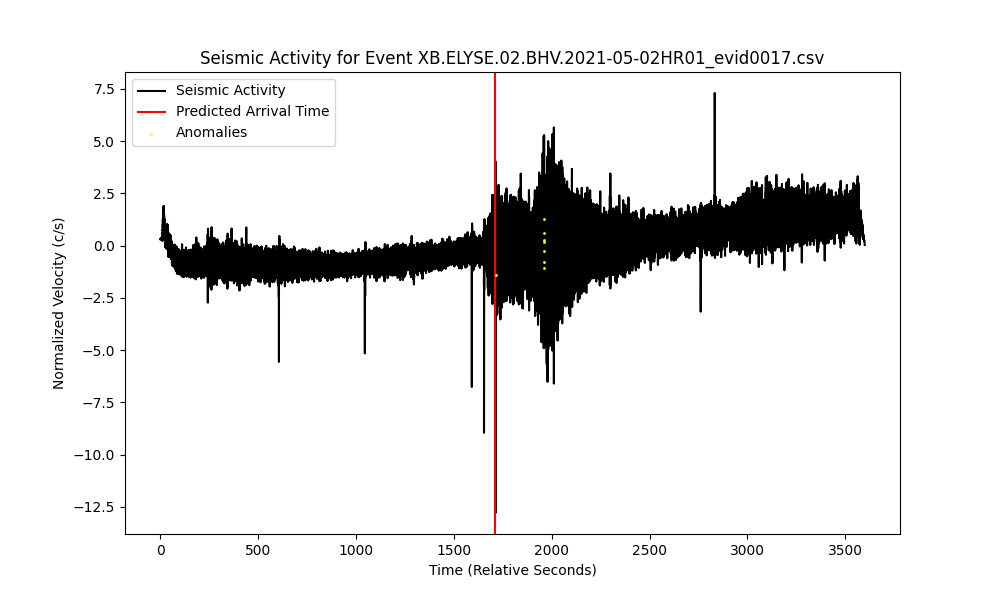
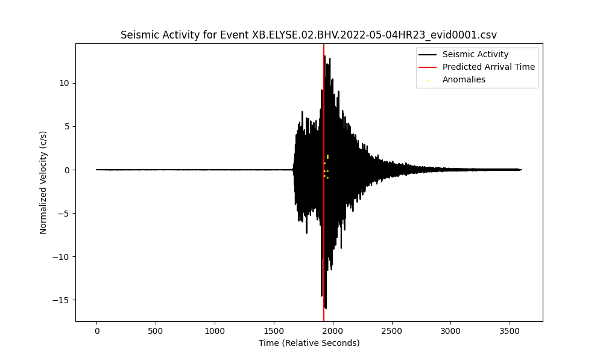

It is pretty apparent that more data for Mars is needed to properly predict the arrival times.


## Paper
[This](https://www.overleaf.com/read/npgrwymqkwxb#5cf32e) is the paper we wrote alongside our development of the code that describes the model and different approaches to the challenge.


<!-- ## Notes -->


## References
- [Darts: User-Friendly Modern Machine Learning for Time Series](http://jmlr.org/papers/v23/21-1177.html)
- [ObsPy: A Python Toolbox for Seismology](https://pubs.geoscienceworld.org/ssa/srl/article-pdf/81/3/530/2762059/530.pdf)
- [Convolutional Neural Network for Earthquake Detection and Location](https://www.science.org/doi/pdf/10.1126/sciadv.1700578)
- [PyTorch: An Imperative Style, High-Performance Deep Learning Library](http://papers.neurips.cc/paper/9015-pytorch-an-imperative-style-high-performance-deep-learning-library.pdf)
- [Darts: User-Friendly Modern Machine Learning for Time Series](http://jmlr.org/papers/v23/21-1177.html)
- [Apollo Passive Seismic Experiment Data Description](https://pds-geosciences.wustl.edu/lunar/urn-nasa-pds-apollo_pse/document/apollo_pse_description.pdf)
- [Earth Seismogram Viewer](https://www.earthquakescanada.nrcan.gc.ca/stndon/wf-fo/index-en.php)