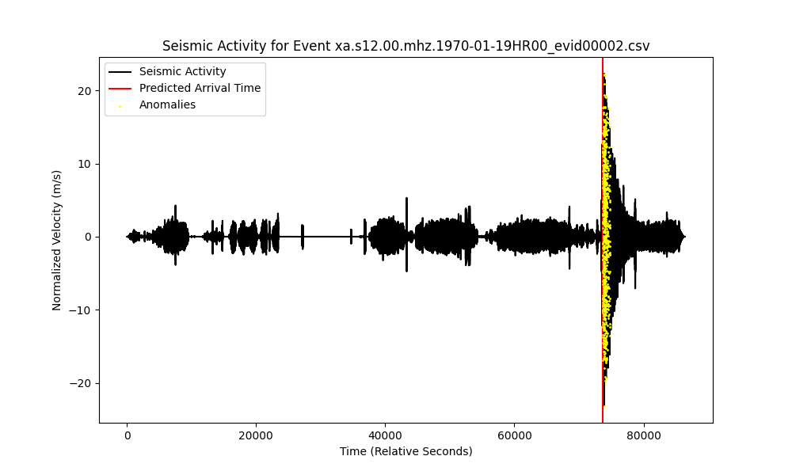
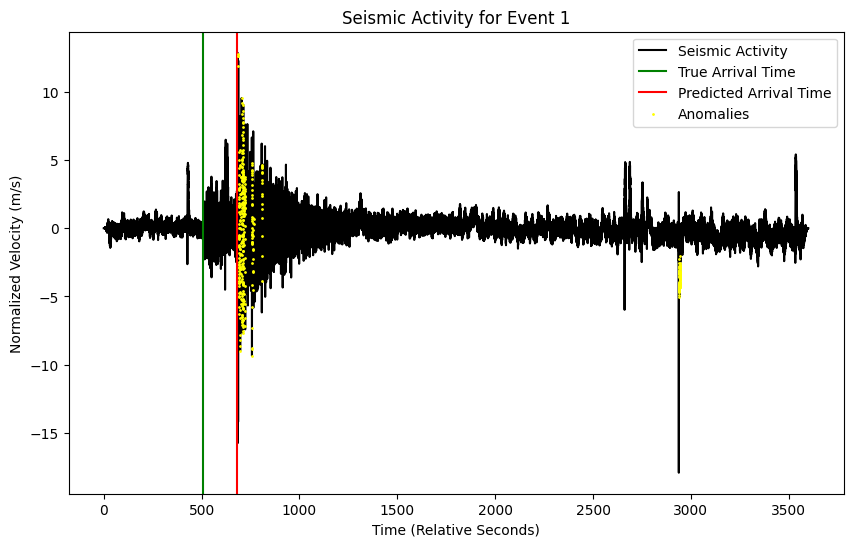
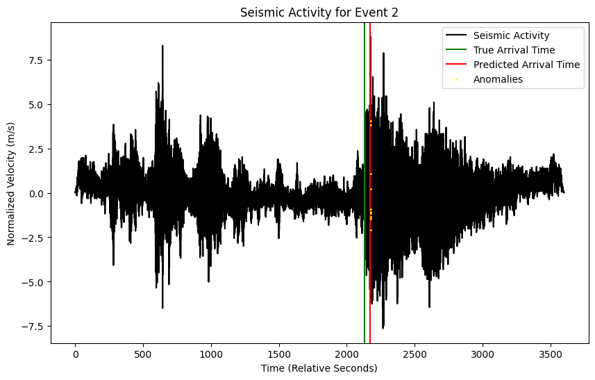

# Aberration Algorithm

This algorithm is designed for detecting when seismic activity begins on the Moon and Mars. [This](https://www.spaceappschallenge.org/nasa-space-apps-2024/find-a-team/aberration1/?tab=project) is our NASA Space Apps 2024 submission.


## Installation
Install the packages in the `requirements.txt` file by running
```
    pip install requirements.txt
```
in your command prompt.

Clone the repository and feel free play around with the notebooks.


## Models
### Classical Models
- [Short-Term Average / Long-Term Average (STA/LTA)](./models/classical/sta_lta.ipynb)
### Machine Learning Models
- [Convolutional Neural Network Using TensorFlow](./models/machine_learning/cnn_sigmoid.ipynb) **(MAIN)**
- [Random Forest Classifier Using ScikitLearn](./models/machine_learning/sklearn.ipynb)
- [Regular Neural Network Using PyTorch](./models/machine_learning/pytorch.ipynb)
- [Forecasting Anomaly Detection Using Darts](./models/machine_learning/darts.ipynb)

## Paper
[This](https://www.overleaf.com/read/npgrwymqkwxb#5cf32e) is the paper we wrote alongside our development of the code that describes the model and different approaches to the challenge.

## Data
### Format
The data was provided by the [Space Apps 2024 Seismic Detection Data Packet](https://wufs.wustl.edu/SpaceApps/data/space_apps_2024_seismic_detection.zip).

The training and testing data, for both the Moon and Mars, where given in `.csv` and `.mseed` files, so we made sure that our model works well at taking both as input. Additionally, our model *should* be able to accept `hdf5` and `numpy` data.

### Files
The files are too large to push through Git to GitHub, so we make the following warning:
> **WARNING:** To successfully run the model for either training or testing, make sure to download the data from the link above and move/copy/cut the folders `lunar` and `mars` from the downloaded `.zip` file to inside the root folder `data` in this repository.


## Images
Let us show some results of the model when applied to the test data. The following two images are on the first test data for the Moon. The red vertical line is the prediction of the arrival time.


This image is identitical to the one above, but we have also shown the predicted anomaly points.


For Mars, we have the predictions on the train data




## Notes


## References
- [Darts: User-Friendly Modern Machine Learning for Time Series](http://jmlr.org/papers/v23/21-1177.html)
- [ObsPy: A Python Toolbox for Seismology](https://pubs.geoscienceworld.org/ssa/srl/article-pdf/81/3/530/2762059/530.pdf)
- [Convolutional Neural Network for Earthquake Detection and Location](https://www.science.org/doi/pdf/10.1126/sciadv.1700578)
- [PyTorch: An Imperative Style, High-Performance Deep Learning Library](http://papers.neurips.cc/paper/9015-pytorch-an-imperative-style-high-performance-deep-learning-library.pdf)
- [Darts: User-Friendly Modern Machine Learning for Time Series](http://jmlr.org/papers/v23/21-1177.html)
- [Apollo Passive Seismic Experiment Data Description](https://pds-geosciences.wustl.edu/lunar/urn-nasa-pds-apollo_pse/document/apollo_pse_description.pdf)
- [Earth Seismogram Viewer](https://www.earthquakescanada.nrcan.gc.ca/stndon/wf-fo/index-en.php)